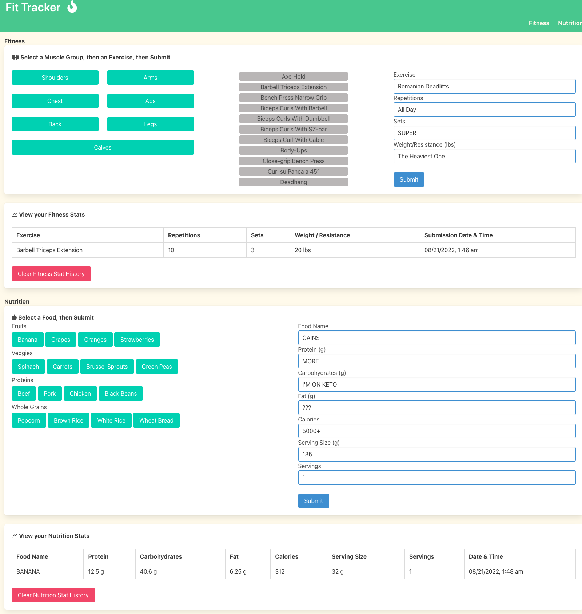

## Fit Tracker

## Table of Contents
* [Description](#description)
* [Installation instructions](#installation-instructions)
* [Usage Information](#usage-information)
* [License](#license)
* [Contribution Guidelines](#contribution-guidelines)
* [Test Instructions](#test-instructions)
* [Questions](#questions)

## Description
Do you have time to talk about the frustrating experience of today’s Fitness Apps in the app store?

Have you ever tried Apps that track your steps and your calories, after slaving in the gym for hours, only to find out that you power-walked 2,000 steps and burned a measly 5 calories?

Many fitness apps track what you are doing, but not how you’re doing it. Fit Tracker is different. 
Fit Tracker allows you to log your workouts in detail from the first steps on the treadmill to the last sweaty set of Romanian Deadlifts. 

You can put in your fitness activity, repetition, sets, and level of resistance.

Wanna log your superset, Bro? Well, now you can. 

This app is about tracking YOUR progress, YOUR journey, and YOUR successes. It doesn’t matter what Cindy from Ohio did, it’s about what you did in the gym today that matters.

(Sorry, Cindy. Nothing personal.)

This app was built using HTML5, CSS3, JavaScript, jQuery, Bulma.css, Moment.js, and Font Awesome

APIs:
Fitness: https://wger.de/en/software/api
Nutrition: https://fdc.nal.usda.gov/api-guide.html

## Installation Instructions
N/A

## Usage Information
[Click here to check it out!](https://sprantis.github.io/fit-tracker/)

## License
[MIT](https://opensource.org/licenses/MIT)

## Contribution Guidelines
N/A

## Test Instructions
N/A

